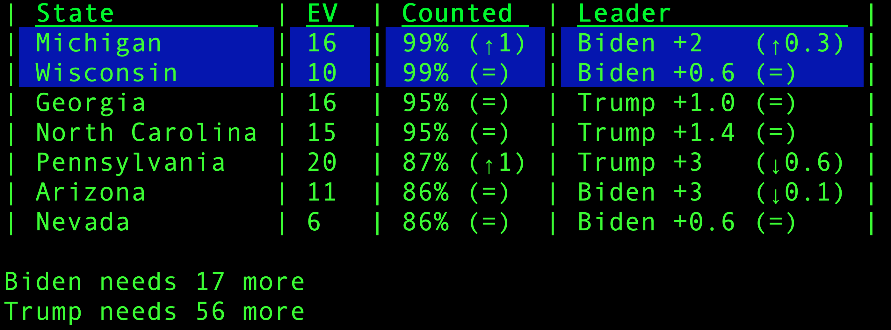
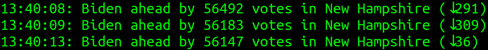

# 2024 State Poll Watcher

Track live poll results by state.



To set up:
1. Install [Bun](https://bun.sh/)
1. Clone/download the repo
1. Run `bun install`

To start watching poll results, run:

```shell
bun start
```

Results refresh every 10 seconds. Comparison with 10 minutes ago is shown in the brackets. EV stands for electoral votes.

The states being displayed can be changed by editing the `STATES_TO_WATCH` value at the top of the file.

The Guardian's API is used for retrieving voting data, which uses calls from AP. When The Guardian calls states, the rows highlight accordingly.

# Vote Difference Watcher
If the votes for each candidate in a state are very close, you can watch the number of votes that one of them is ahead by:

```shell
// bun run vote_difference.js <state_code>
bun run vote_difference.js PA
```


